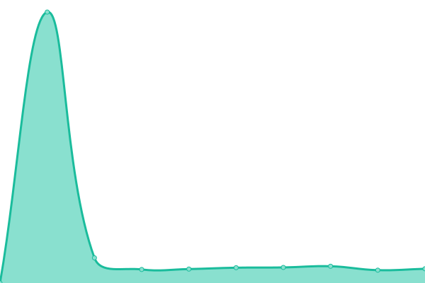
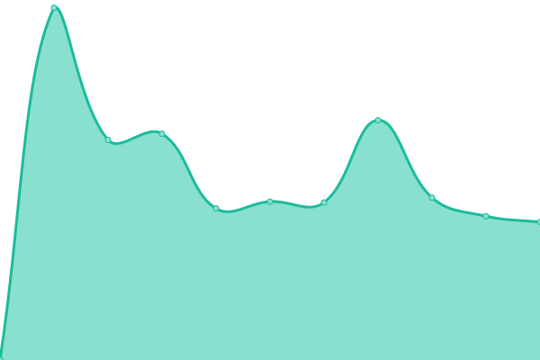
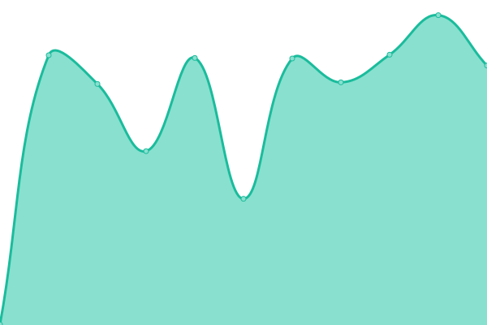

# [📈 Live Status](https://rdpupptime.github.io/upptime): <!--live status--> **🟩 All systems operational**

This repository contains the open-source uptime monitor and status page for [rdpupptime](https://rdpupptime.github.io/upptime), powered by [Upptime](https://github.com/upptime/upptime).

With [Upptime](https://upptime.js.org), you can get your own unlimited and free uptime monitor and status page, powered entirely by a GitHub repository. We use [Issues](https://github.com/rdpupptime/upptime/issues) as incident reports, [Actions](https://github.com/rdpupptime/upptime/actions) as uptime monitors, and [Pages](https://rdpupptime.github.io/upptime) for the status page.

<!--start: status pages-->
<!-- This summary is generated by Upptime (https://github.com/upptime/upptime) -->
<!-- Do not edit this manually, your changes will be overwritten -->

| URL                                          | Status | History                                                                                             | Response Time                                                                      | Uptime                                                                                                                                                                                                                         |
| -------------------------------------------- | ------ | --------------------------------------------------------------------------------------------------- | ---------------------------------------------------------------------------------- | ------------------------------------------------------------------------------------------------------------------------------------------------------------------------------------------------------------------------------ |
| [RDP AI](https://rdpai.utools.club)          | 🟩 Up  | [rdp-ai.yml](https://github.com/rdpupptime/upptime/commits/master/history/rdp-ai.yml)               |  273ms        |                |
| [SuperPi@Home](https://piathome.utools.club) | 🟩 Up  | [super-pi-home.yml](https://github.com/rdpupptime/upptime/commits/master/history/super-pi-home.yml) |  294ms |  |
| [RDP Archive](https://archive.utools.club)   | 🟩 Up  | [rdp-archive.yml](https://github.com/rdpupptime/upptime/commits/master/history/rdp-archive.yml)     |  276ms   |      |
| [RDP Blog](https://blog.rdpstudio.top)       | 🟩 Up  | [rdp-blog.yml](https://github.com/rdpupptime/upptime/commits/master/history/rdp-blog.yml)           |  409ms      |           |

<!--end: status pages-->

[**Visit our status website →**](https://rdpupptime.github.io/upptime)

## 📄 License

- Code: [MIT](./LICENSE) © [rdpupptime](https://rdpupptime.github.io/upptime)
- Data in the `./history` directory: [Open Database License](https://opendatacommons.org/licenses/odbl/1-0/)
